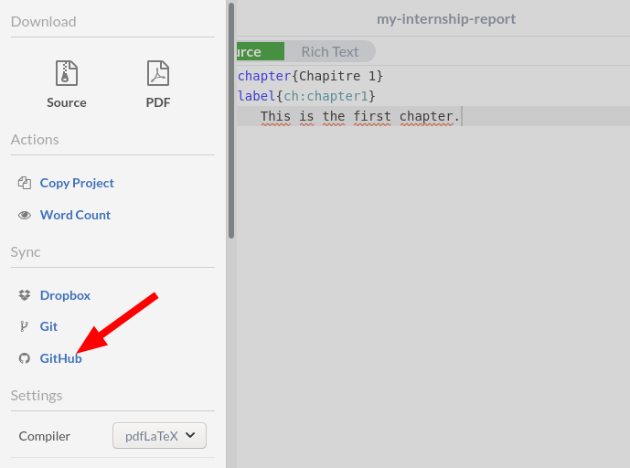

# latex-student-report-template

A [LaTeX](https://www.latex-project.org) template for your reports.

## Getting started

I recommend installing [TeX Live](https://www.tug.org/texlive) and [Visual
Studio Code](https://code.visualstudio.com).
[Overleaf](https://www.overleaf.com) is a good alternative if you prefer to work
online.

### *First step:* Generating a new repository for your report

Press "Use this template" button to generate a new repository.

Choose a name for your new report and make it private.

### *Second step:* Editing the project online using Overleaf

If you chose to use Overleaf then import your project from GitHub.

You will be asked to link your GitHub account to your Overleaf account.

Press "Authorize overleaf" if you trust Overleaf to read and write to all your
public and private repositories.

Go back to the [main page](https://www.overleaf.com) and import your project
again.

Choose your newly created repository and press "Import to Overleaf".

Done. At this stage, you should be able to start editing your new report.

#### Pushing changes from Overleaf to GitHub (Optional)

Let's add a line in chapter 1 on Overleaf.

To push those changes back to GitHub, press "Menu" then "GitHub".

And next.

At the next screen, press "Push Overleaf changes to GitHub".

Now write a [commit message](https://chris.beams.io/posts/git-commit) and press
"Commit".

Go back to GitHub to see your changes.

### *Alternative:* Editing the project offline using Visual Studio Code

You need to install [TeX Live](https://www.tug.org/texlive), [Visual Studio
Code](https://code.visualstudio.com) and [LaTeX
Workshop](https://marketplace.visualstudio.com/items?itemName=James-Yu.latex-workshop)
extension.

## Contributing 

Pull requests are welcome. For major changes, please open an issue first to
discuss what you would like to change.

## License 

This project is licensed under the MIT License - see the [LICENSE](LICENSE) file
for details.
